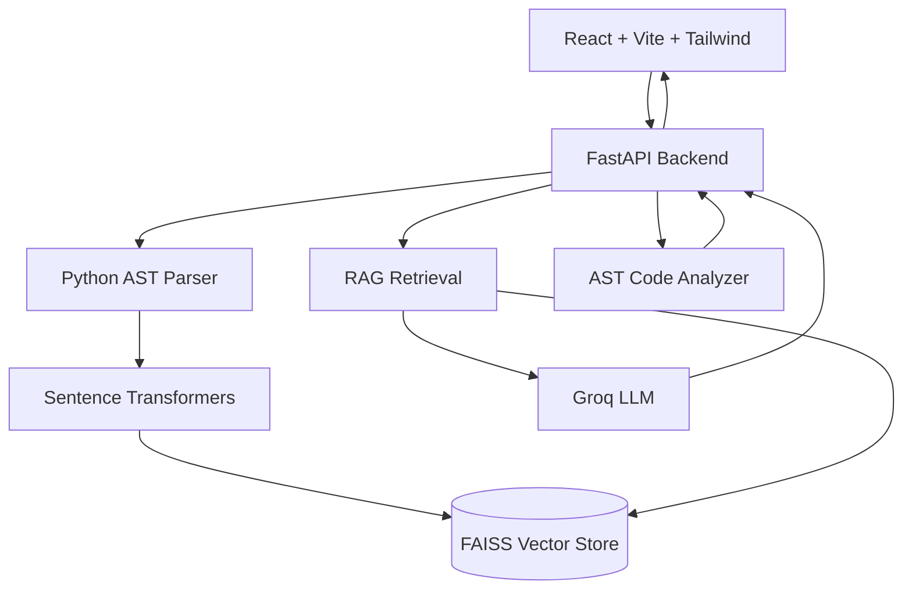

<div align="center">

# 🧠 CodeSense

### AI-powered code intelligence and debugging assistant

Ask questions about your Python code, debug failures, and analyze quality —
grounded in your actual source, with line-level attribution.


</div>

---

## 📌 Overview

CodeSense combines **Python AST parsing**, **semantic embeddings**, **FAISS vector search**, **Retrieval-Augmented Generation (RAG)**, and an **LLM** to help developers understand and debug their code.

Instead of dumping an entire codebase into an LLM prompt, CodeSense parses code into meaningful units (functions, classes, methods, imports), retrieves only what is relevant to the question, and returns **grounded answers with source attribution**.

<!-- Add a demo GIF or screenshots here -->
<!--  -->

## ✨ Features

| Feature | What it does | Uses LLM? |
| --- | --- | --- |
| **AI Code Q&A** | Ask natural-language questions about uploaded Python code and get answers with source lines | Yes |
| **AI Debugger** | Explains why code fails and how to fix it, in a structured format | Yes |
| **Code Quality Analysis** | Reports per-function line ranges, size, and a branching/complexity score | **No** (deterministic) |

### 1. AI Code Q&A

1. Parse Python source with the `ast` module.
2. Split it into chunks: functions, classes, methods, imports.
3. Generate semantic embeddings for each chunk.
4. Store embeddings in FAISS.
5. Retrieve the most relevant chunks for the user's question.
6. Send the retrieved context to the LLM.
7. Return the answer with source attribution.

> **Example:** *"Where is the logout logic?"*
> → Identifies the relevant class/method and shows the corresponding source lines.

### 2. AI Debugger

> **Example:** *"Why can `calculate_average` fail when the input list is empty?"*

Returns a predictable, structured response:

- **Problem** — what goes wrong
- **Why** — the root cause
- **Fix** — the corrected approach
- **Explanation** — the reasoning behind it

The answer is generated from retrieved code context, not from blindly sending the whole project to the LLM.

### 3. Code Quality Analysis

Deterministic analysis built on the Python AST. For each function:

- Function name
- Source line range
- Number of lines
- Custom branching/complexity score

No LLM involved, so results are fast, reproducible, and free.

---

## 🏗️ Architecture



### RAG Pipeline

```text
Python Source
   └─► AST Parser
        └─► Code Chunks (functions / classes / methods / imports)
             └─► Sentence Transformer
                  └─► Embeddings
                       └─► FAISS index
                            │
        User Question ──────┤
                            ▼
                   Semantic Retrieval
                            └─► Relevant Code Chunks
                                 └─► Prompt Builder
                                      └─► Groq LLM
                                           └─► Grounded Answer + Sources
```

### Debugging Pipeline

```text
User Question
   └─► Semantic Retrieval
        └─► Relevant Code
             └─► Debug Prompt
                  └─► Groq LLM
                       └─► Structured Response (Problem / Why / Fix / Explanation)
```

### Code Analysis Pipeline

```text
Python File
   └─► Python AST
        └─► Function Detection
             └─► Lines + Complexity
                  └─► Analysis Response
```

---

## 🧰 Tech Stack

| Layer | Technologies |
| --- | --- |
| **Frontend** | React, Vite, Tailwind CSS, Axios, React Markdown |
| **Backend** | Python, FastAPI, Pydantic |
| **AI / ML** | Sentence Transformers (`all-MiniLM-L6-v2`), FAISS, Groq LLM |
| **Code Intelligence** | Python `ast` module |
| **Storage** | FAISS index + JSON document metadata |

---

## 🎯 Design Decisions

**Why AST instead of plain-text chunking?**
The AST exposes real code structure — functions, classes, methods, imports, and exact line ranges. Chunks are meaningful units rather than arbitrary character windows, which improves retrieval quality and makes precise source attribution possible.

**Why embeddings instead of keyword search?**
Code questions are semantic. For *"Where is the authentication logic?"*, the relevant function may never contain the word "authentication". Embeddings retrieve by meaning.

**Why FAISS?**
Efficient vector similarity search that is lightweight enough for local development. The index is an inner-product index over **normalized embeddings** (equivalent to cosine similarity).

**Why RAG?**
Retrieving only relevant chunks gives smaller prompts, more relevant context, source attribution, and better grounding than sending the whole codebase on every question.

**Why structured debugging output?**
A fixed *Problem / Why / Fix / Explanation* format is predictable for the frontend and easier for users to scan.

**Why a deterministic analyzer alongside the LLM?**
Metrics like line counts and branching scores shouldn't depend on a probabilistic model. Keeping them AST-based makes them reproducible and testable.

---

## 📁 Project Structure

```text
CodeSense/
├── backend/
│   ├── app/
│   │   ├── main.py
│   │   ├── routes/
│   │   │   ├── upload.py
│   │   │   ├── indexing.py
│   │   │   ├── query.py
│   │   │   ├── ask.py
│   │   │   ├── debug.py
│   │   │   ├── analyze.py
│   │   │   ├── review.py
│   │   │   └── project.py
│   │   ├── services/
│   │   │   ├── rag.py
│   │   │   ├── parser.py
│   │   │   ├── embeddings.py
│   │   │   ├── vector_store.py
│   │   │   ├── code_analyzer.py
│   │   │   ├── prompt_builder.py
│   │   │   ├── debug_prompt.py
│   │   │   ├── review_prompt.py
│   │   │   ├── grounded_review_prompt.py
│   │   │   └── providers/
│   │   │       └── groq.py
│   │   ├── models/
│   │   │   └── project.py
│   │   └── schemas/
│   │       ├── debug.py
│   │       └── review.py
│   ├── data/
│   │   ├── index.faiss
│   │   └── documents.json
│   ├── .env
│   └── requirements.txt
├── frontend/
│   ├── src/
│   │   ├── components/
│   │   ├── services/
│   │   ├── App.jsx
│   │   ├── main.jsx
│   │   └── index.css
│   ├── package.json
│   └── vite.config.js
├── .gitignore
└── README.md
```

---

## 🚀 Getting Started

### Prerequisites

- Python 3.10+
- Node.js 18+
- A [Groq API key](https://console.groq.com/)

### Backend

```bash
cd backend

python -m venv .venv
source .venv/bin/activate        # Windows: .venv\Scripts\activate

pip install -r requirements.txt
```

Create `backend/.env`:

```env
GROQ_API_KEY=your_api_key
```

Start the server:

```bash
python -m uvicorn app.main:app --reload
```

| Service | URL |
| --- | --- |
| API | http://127.0.0.1:8000 |
| Interactive docs (Swagger) | http://127.0.0.1:8000/docs |

### Frontend

In a second terminal:

```bash
cd frontend

npm install
npm run dev
```

Open http://localhost:5173

---

## 🔌 API Reference

| Method | Endpoint | Purpose |
| --- | --- | --- |
| `POST` | `/api/index` | Index Python source |
| `POST` | `/api/ask` | Ask questions about indexed code |
| `POST` | `/api/debug` | Debug indexed code |
| `POST` | `/api/analyze` | Analyze Python code |
| `POST` | `/api/upload` | Upload a source file |
| `POST` | `/api/project/reset` | Reset the indexed project |

Full request/response schemas are available in the Swagger docs at `/docs`.

---

## ⚠️ Limitations

- Focused primarily on **Python** code.
- The analyzer is a lightweight AST-based tool; its complexity value is a **custom branching score**, not a full industry-standard static-analysis suite.
- FAISS index and metadata are stored **locally**.
- Designed as a local development project, not a production multi-user system.

## 🗺️ Roadmap

- [ ] GitHub repository integration
- [ ] JavaScript / TypeScript support
- [ ] Deeper static analysis
- [ ] Repository-level dependency graphs
- [ ] Authentication
- [ ] Persistent database storage
- [ ] More advanced code review
- [ ] IDE integration

---

## 👤 Author

**Shubham Kumar Chaurasia** · [GitHub](https://github.com/shubhamChaurasia55) · [LinkedIn](https://linkedin.com/in/shubhamchaurasia12)

If you found this project useful, consider giving it a ⭐.
